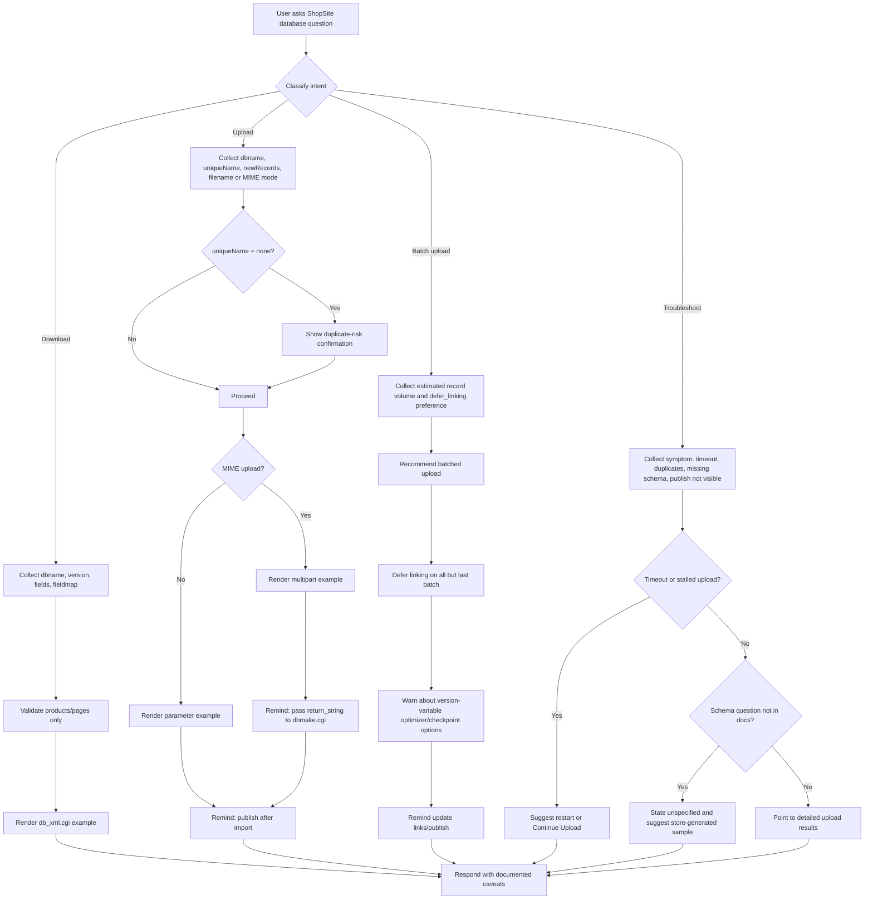
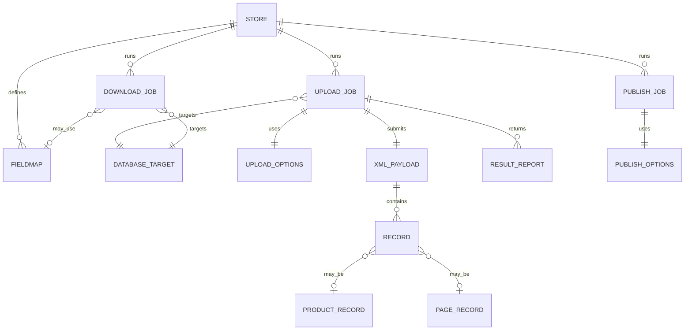

 # Designing a ShopSite Database Documentation Skill for Anthropic

## Executive Summary

The ShopSite documentation that was actually crawlable supports a clear high-level workflow for automated database operations: download XML with `db_xml.cgi`, upload XML with `dbupload.cgi`, finalize MIME uploads with `dbmake.cgi`, and regenerate the storefront with `generate.cgi`. The documented automated scope is limited to **Products** and **Pages**; adjacent database-upload pages also reinforce that ShopSite database upload is centered on product and page data, not on uploading Orders or Associates. citeturn5view0turn12view1turn23search1turn29search4

What is well documented is the **CGI surface area**: endpoint names, core parameters, the MIME multipart upload pattern, matching behavior via `uniqueName`, handling of large uploads, deferred linking, restart/continue behavior, and the need to publish after uploads. What is **not** well documented in the crawlable pages is equally important: the docs do **not** fully enumerate the product/page XML element schema, do **not** provide a page-side XML example, do **not** state a canonical authentication mechanism for automated CGI calls, and do **not** publish a full error-code catalog. The MIME example itself is somewhat ambiguous because it includes a `<Response>` block inside the XML body without explaining whether that block is required for uploads or merely illustrative. citeturn5view0turn12view1turn12view0turn27search0turn29search1turn29search5

Because of those gaps, the strongest skill design is **not** a blind autonomous uploader. The recommended design is a **documentation-grounded advisor and artifact generator** that can: explain ShopSite’s upload/download mechanics, generate safe request examples, generate minimal XML and MIME templates, recommend matching/batching strategies, and explicitly label anything not specified by the docs as **unspecified** rather than inferred fact. That design is well supported by the source material and avoids inventing undocumented XML schema or undocumented authentication behavior. citeturn5view0turn12view1turn12view0turn28search3

## Source Scope and Pages Crawled

The exact current-version help URL you provided exposed only the JavaScript shell of the ShopSite help center to the crawler, not the inner article body. An attempt to treat the `/database` path as a crawlable directory also did not yield a page index. To avoid guessing, I limited fallback evidence to **official ShopSite help pages** with matching database filenames/titles that the search index could retrieve, and I mark version-sensitive details accordingly. No third-party sources were used in the findings below. citeturn1view0turn14view0

| Page filename or title | Status in this research | What it contributed | Evidence |
|---|---|---|---|
| `database.automated_XML_upload.html` via current version-15 wrapper | Current target, shell only | Established the requested current target and the crawl limitation | Current wrapper citeturn1view0 |
| `Database Automated XML Upload/Download` | Official fallback help page | Core automated XML workflow, CGI names, parameters, large-upload guidance, publish step | Main page citeturn5view0turn24search1 |
| `MIME Encoded XML Upload` | Official fallback help page | Multipart form example, XML example, `dbmake.cgi` follow-up requirement | MIME page citeturn12view1 |
| `Database XML Upload/Download SDK` | Official fallback help page | SDK packaging, installation expectations, `dbtest.pl`, browser-access/auth prompt | SDK page citeturn12view0turn15search1 |
| `Database Upload/Download` | Official fallback help page | Upload/download screen scope; confirms products/pages upload focus | Upload/download screen citeturn23search1turn30search0turn30search2 |
| `Database Upload` | Official fallback help page | `Update Links` after deferred linking, database-upload workflow context | Upload screen citeturn29search4turn28search3 |
| `Database Upload - Match Upload Fields` | Official fallback help page | Field matching behavior, defaults for missing fields, update-vs-create logic | Match-fields page citeturn28search3turn29search3 |
| `Database Upload Progress` | Official fallback help page | Continue/discard upload, checkpoint-style recovery, unfinished-upload lockout | Progress page citeturn29search1 |
| `Databases Upload Results` | Official fallback help page | Success/failure result surface, detailed upload report, publish reminder | Results page citeturn29search2turn29search5 |

## ShopSite XML Interface Findings

The automated XML interface is described as a programmatic XML interface for automatically uploading or downloading store information. The docs say the relevant automated surface uses **three CGI programs** for downloading, uploading, and publishing, and that those CGIs can be called from an automated script or manually via a standard HTTP POST function. The example URL format uses a store domain plus a back-office CGI path, such as a `db_xml.cgi` query string. citeturn5view0

| Endpoint or artifact | Purpose | Method or transport described | Parameters explicitly documented | Notes | Evidence |
|---|---|---|---|---|---|
| `db_xml.cgi` | Download all or part of a database in XML | Standard HTTP POST is described; docs also show URL/query examples | `clientApp`, `dbname`, `download_shopsite_version`, `version`, `fields`, `fieldmap` | Examples show query-string style even though the text says standard HTTP POST; the docs do not declare whether GET is supported or merely illustrative | Main automated page citeturn5view0 |
| `dbupload.cgi` | Upload MIME-encoded XML or import an XML file already present in the HTML output directory | Standard HTTP POST; MIME multipart example shown | `clientApp`, `dbname`, `filename`, `uniqueName`, `newRecords`, `defer_linking`, `restart`; older official page also lists `checkpoint` and `use_optimizer` | Version drift matters: `checkpoint` and `use_optimizer` appear in one official automated page and in the MIME example, but not in the later parameter table capture | Automated pages citeturn5view0turn24search1turn12view1 |
| `dbmake.cgi` | Follow-up processing after MIME upload | URL with opaque return string | `return_string` as returned by upload | The docs say the returned variables must be passed **exactly as returned**; the contents of that string are not specified | MIME page citeturn12view1 |
| `generate.cgi` | Publish/regenerate store content after import | Same CGI invocation model as automated tools | `clientApp`, `htmlpages`, `custompages`, `index`, `regen`, `sitemap` | `sitemap` appears in later official capture; an older automated capture stops short of that option, so treat as version-sensitive | Automated pages citeturn5view0turn24search1 |
| `xml_sdk.zip` containing `dbtest.pl` | SDK for developers building XML upload/download clients | ZIP download; installed as CGI on same server as store | Not a runtime endpoint in the docs, but relevant tooling | The SDK page promises useful information and sample Perl code, but the crawlable docs do not expose the code itself | SDK page citeturn12view0turn15search1 |

The parameter surface is the most concrete part of the docs. ShopSite explicitly marks CGI parameters as required or optional, which makes them a strong fit for a skill slot schema. citeturn5view0turn24search1

| Parameter | Applies to | Required in docs | Type or allowed values | Meaning | Evidence |
|---|---|---|---|---|---|
| `clientApp` | `db_xml.cgi`, `dbupload.cgi`, `generate.cgi` | Required | Integer-like constant `1` | Interface version identifier | Automated pages citeturn5view0turn24search1 |
| `dbname` | `db_xml.cgi`, `dbupload.cgi` | Required | Enum: `pages`, `products` | Database being accessed or uploaded | Automated pages citeturn5view0turn24search1 |
| `download_shopsite_version` | `db_xml.cgi` | Optional | Literal `1` | Request running ShopSite version in `major.minor` format | Automated page citeturn5view0 |
| `version` | `db_xml.cgi` | Optional | Enum: `8.3` default, `8.2`, `8.1`, `8.0`, `7.1` | XML format version for compatibility | Automated page citeturn5view0 |
| `fields` | `db_xml.cgi` | Optional | Pipe-delimited list, e.g. `|field1|field2|` | Limits which fields are downloaded | Automated page citeturn5view0 |
| `fieldmap` | `db_xml.cgi` | Optional | Existing fieldmap name | Maps field numbers and IDs to output data | Automated page citeturn5view0 |
| `filename` | `dbupload.cgi` | Optional | String filename | Import an XML file already uploaded to the HTML output directory | Automated pages citeturn5view0turn28search3 |
| `uniqueName` | `dbupload.cgi` | Optional | Enum: `Name`, `SKU` for Products, `File+Name` for Pages, `(none)` | Record matching key used to map upload rows to existing records | Automated pages citeturn5view0turn24search1 |
| `newRecords` | `dbupload.cgi` | Optional | `yes` default, `no` | Whether unmatched new rows are added or ignored | Automated pages citeturn5view0turn24search1 |
| `defer_linking` | `dbupload.cgi` | Optional | `no` default, `yes` | Postpone linking when large databases are uploaded in batches | Automated pages citeturn5view0turn24search1 |
| `restart` | `dbupload.cgi` | Optional | Literal `1` | Resume an interrupted or timed-out upload | Automated pages citeturn5view0turn24search1 |
| `checkpoint` | `dbupload.cgi` | Optional in one official capture | Integer, default `500` | Interval between record checkpoints for large databases | Older official automated page only; treat as version-variable | Older automated page citeturn24search1 |
| `use_optimizer` | `dbupload.cgi` | Optional in one official capture; also shown in MIME example | `no` default, `yes` | Run link optimizer during upload; slower upload, potentially faster linking on very large databases | Documented inconsistently across official pages | Older automated page and MIME example citeturn24search1turn12view1 |
| `htmlpages` | `generate.cgi` | Optional | Flag `1` | Generate HTML pages | Automated page citeturn5view0 |
| `custompages` | `generate.cgi` | Optional | Flag `1` | Generate custom pages | Automated page citeturn5view0 |
| `index` | `generate.cgi` | Optional | Flag `1` | Update search index | Automated page citeturn5view0 |
| `regen` | `generate.cgi` | Optional | Flag `1` | Full regenerate instead of changed-only publish | Automated page citeturn5view0 |
| `sitemap` | `generate.cgi` | Optional | Flag `1` | Generate Google-type XML sitemap | Later official capture; version-sensitive | Automated page citeturn5view0 |
| `return_string` | `dbmake.cgi` | Required after MIME upload | Opaque string | Follow-up argument that must be passed exactly as returned | MIME page citeturn12view1 |

The MIME page supplies the only concrete XML example I could crawl. It is **product-oriented**, not page-oriented, and it leaves several things unspecified. Most importantly, the docs do **not** state which XML elements are required versus optional for a valid product or page record. citeturn12view1

| Layer | Field or element | Example shown | Type | Requiredness in docs | Analytical note | Evidence |
|---|---|---|---|---|---|---|
| Multipart form field | `clientApp` | `1` | Integer-like constant | Explicitly required for upload | Formal CGI parameter | MIME page + automated page citeturn12view1turn5view0 |
| Multipart form field | `dbname` | `products` | Enum | Explicitly required for upload | Formal CGI parameter | MIME page + automated page citeturn12view1turn5view0 |
| Multipart form field | `uniqueName` | `Name` | Enum | Optional in parameter docs | Example uses product name matching | MIME page + automated page citeturn12view1turn5view0 |
| Multipart form field | `batchsize` | `500` | Integer | Not formally documented on MIME page | Likely related to checkpoint behavior; exact semantics not explained there | MIME page + older automated page citeturn12view1turn24search1 |
| Multipart form field | `newRecords` | `yes` | Enum | Optional in parameter docs | Controls whether unmatched new rows are added | MIME page + automated page citeturn12view1turn5view0 |
| Multipart form field | `use_optimizer` | `no` | Enum | Inconsistent across official pages | Present in example; not consistently listed | MIME page + older automated page citeturn12view1turn24search1 |
| Multipart form field | `defer_linking` | `no` | Enum | Optional in docs | Used for staged batch uploads | MIME page + automated page citeturn12view1turn5view0 |
| File-bearing part | `Desktop` with filename | `drive:\dirpath\filename.xml` | String | Example only | The docs do not explain whether `Desktop` is fixed or illustrative; a skill should treat it as example-only | MIME page citeturn12view1 |
| XML declaration | `<?xml version="1.0" encoding="iso-8859-1"?>` | Product example | Metadata | Example only | Encoding is shown, not normatively declared for all uploads | MIME page citeturn12view1 |
| DOCTYPE | `ShopSiteProducts` with external DTD reference | Product example | XML declaration | Example only | DTD location is shown, but full DTD content was not in the crawled pages | MIME page citeturn12view1 |
| Root element | `<ShopSiteProducts>` | Product example | Container | Example only | Product-side root explicitly shown | MIME page citeturn12view1 |
| Metadata block | `<Response>` | Product example | Container | **Unspecified** whether required | Ambiguous because it looks like a response wrapper inside upload XML | MIME page citeturn12view1 |
| Metadata field | `<ResponseCode>1</ResponseCode>` | `1` | Integer-like | Example only | Only success example is shown | MIME page citeturn12view1 |
| Metadata field | `<ResponseDescription>success</ResponseDescription>` | `success` | String | Example only | Only success description is shown | MIME page citeturn12view1 |
| Records block | `<Products><Product>...` | Product example | Container | Example only | Product list wrapper shown | MIME page citeturn12view1 |
| Product field | `<Name>` | `product-name` | String | Example only | Only `Name` is explicitly shown as a product child element | MIME page citeturn12view1 |
| Page XML structure | Not shown | — | — | **Unspecified** | Pages are supported as `dbname=pages`, but no page XML example is shown on the crawlable automated XML pages | Automated page + MIME page citeturn5view0turn12view1 |

A useful secondary clue comes from adjacent ShopSite database-upload docs: ShopSite exposes broad underlying field catalogs for **products** and **pages** in tabular upload templates, including fields such as `Name`, `Price`, `Taxable`, `SKU`, `Graphic`, `Product Description`, `Weight`, and `File name` for products, and `Name`, `Graphic`, `Text 1`, `Text 2`, `Text 3`, `Link Name`, `Template`, `Columns`, and `File name` for pages. Those fields are useful for skill vocabulary, but the docs I could crawl do **not** explicitly map them one-to-one to XML element names. citeturn29search0

The skill should therefore maintain two modes of truth:

| Mode | What the skill may say confidently | What it must mark as unspecified |
|---|---|---|
| Strict evidence mode | CGI names, parameters, example MIME shape, explicit XML tags actually shown | Full product/page XML schema, page XML example, canonical auth method |
| Assisted mode | The same, plus likely product/page field vocabulary from adjacent ShopSite database-upload pages | Any claim that a tabular field name is definitely the official XML tag name |

The following minimal XML artifact is a **derived, shortened example** based on the product-side MIME/XML shape ShopSite shows on its MIME upload page. It is useful as a skill output template, but it should be labeled as a **documentation-derived starter**, not as a complete official schema. citeturn12view1

```xml
--ShopSiteUpload_boundary
Content-Disposition: form-data; name="clientApp"

1
--ShopSiteUpload_boundary
Content-Disposition: form-data; name="dbname"

products
--ShopSiteUpload_boundary
Content-Disposition: form-data; name="uniqueName"

Name
--ShopSiteUpload_boundary
Content-Disposition: form-data; name="newRecords"

yes
--ShopSiteUpload_boundary
Content-Disposition: form-data; name="defer_linking"

no
--ShopSiteUpload_boundary
Content-Disposition: form-data; name="Desktop"; filename="products.xml"
Content-Type: text/xml

<?xml version="1.0" encoding="iso-8859-1"?>
<!DOCTYPE ShopSiteProducts PUBLIC "-//shopsite.com//ShopSiteProduct DTD//EN" "http://www.shopsite.com/XML/1.2/shopsiteproducts.dtd">
<ShopSiteProducts>
  <Response>
    <ResponseCode>1</ResponseCode>
    <ResponseDescription>success</ResponseDescription>
  </Response>
  <Products>
    <Product>
      <Name>example-product</Name>
    </Product>
  </Products>
</ShopSiteProducts>
--ShopSiteUpload_boundary--
```

## Validation, Error Surfaces, and Troubleshooting

The ShopSite pages are stronger on **workflow validation** than on **schema validation**. In other words, they say much more about how uploads should be staged, resumed, linked, and published than about exactly which product/page XML child elements must appear. That distinction should shape the skill. citeturn12view1turn29search1turn29search5

| Validation or troubleshooting rule | What the docs say | Skill behavior this implies | Evidence |
|---|---|---|---|
| Upload scope | Upload targets are products or pages, not every ShopSite table | Refuse or warn on attempts to automate unsupported upload targets such as Orders or Associates | Upload/download docs citeturn23search1turn30search0 |
| URL encoding | Spaces in option values should be replaced with `+` in URLs | Auto-encode query strings and show normalized examples | Automated page citeturn5view0 |
| Matching key choice | `uniqueName=(none)` disables matching and allows duplicates | Force a high-risk confirmation whenever user chooses no unique key | Automated pages citeturn5view0turn24search1 |
| New-record policy | `newRecords=no` ignores rows that do not match existing records | Confirm that the user really wants unmatched rows ignored | Automated pages citeturn5view0turn24search1 |
| Large uploads | For very large databases, split uploads into batches; for all but last batch, defer linking | Offer batch plan, mark interim batches as `defer_linking=yes`, remind user to finish linking/publish | Automated pages + upload screen citeturn5view0turn29search4 |
| Extremely large uploads | One official page says `use_optimizer=yes` may slow upload but help on databases over 100,000 records | Surface this as an optional, version-variable recommendation rather than a hard requirement | Older automated page + MIME example citeturn24search1turn12view1 |
| Interrupted upload | `restart=1` resumes interrupted automated uploads | Build a dedicated troubleshooting intent for resuming partial uploads | Automated pages citeturn5view0turn24search1 |
| Stalled UI upload | If progress stalls, cancel and then use `Continue Upload` from the last checkpoint | Offer a GUI recovery path when the user is describing a back-office upload, not a raw CGI upload | Progress page citeturn29search1 |
| Unfinished upload lockout | You cannot start a new upload or download until an unfinished upload is finished or discarded | Warn users not to start parallel uploads/downloads during unresolved partial work | Progress page citeturn29search1 |
| MIME post-processing | After MIME upload, pass returned variables to `dbmake.cgi` exactly as returned | Always remind users of the `dbmake.cgi` step after MIME upload examples | MIME page citeturn12view1 |
| Publishing after upload | After imported data lands in ShopSite, pages must be regenerated; customers do not see new pages/products until publish | Always include a publish reminder in successful upload guidance | Automated page + upload results page citeturn5view0turn29search5 |
| XML-vs-text upload settings | File separators and item separators do not apply to XML uploads | Suppress irrelevant separator advice in XML-specific flows | Upload file page citeturn28search3 |
| Missing field knowledge | ShopSite advises downloading a page or product in the desired format to inspect needed fields | When users ask for undocumented XML details, suggest using a ShopSite-generated sample rather than inventing schema | Upload file/match-fields pages citeturn28search3 |

The explicit error surface is thin. The crawlable docs show only a success-formatted XML example with `ResponseCode` `1` and `ResponseDescription` `success`, and the UI-oriented result pages say that ShopSite will display success or failure and offer a detailed upload report if errors occur. They do **not** enumerate a canonical machine-readable error catalog. That means the skill should never promise exact ShopSite error codes unless the user provides one from a real run. citeturn12view1turn27search0turn29search2turn29search5

Authentication is also under-specified. The automated XML pages describe standard HTTP POST invocation and example URLs, but they do not document session cookies, auth headers, API keys, or explicit login parameters for the CGI calls. The only explicit auth-related statement in the crawlable set is on the SDK page, which says a browser user will be prompted for back-office login and password if not already signed in. A production skill should therefore treat runtime authentication as **environment-specific and unspecified by the cited ShopSite pages**. citeturn5view0turn12view0

## Proposed Agent Skill Design

Given the source profile, the best skill is a **ShopSite Database Documentation Specialist** with a narrow contract: explain the docs, gather safe parameters, produce citation-grounded examples, and refuse to fabricate undocumented XML schema or undocumented authentication behavior. That design aligns directly with what the ShopSite docs do and do not specify. citeturn5view0turn12view1turn12view0

| Intent | Purpose | Sample user prompts |
|---|---|---|
| Explain automated XML workflow | Summarize end-to-end process | “How does ShopSite automated XML upload work?” |
| Build download request | Generate `db_xml.cgi` examples | “Build a download request for products using a fieldmap.” |
| Build upload request | Generate `dbupload.cgi` examples | “Show the parameters I need to update existing pages.” |
| Build MIME upload template | Produce multipart example for product XML | “Give me a MIME upload example for products.” |
| Choose matching strategy | Recommend `uniqueName` and `newRecords` settings | “Should I match by SKU or Name?” |
| Plan batched upload | Recommend checkpoint/defer-linking strategy | “I have 25,000 products; how should I batch this?” |
| Recover interrupted upload | Recommend `restart`, Continue Upload, or Discard Upload path | “My ShopSite upload timed out halfway through.” |
| Explain publish step | Build `generate.cgi` example and explain flags | “What publish call do I make after import?” |
| Handle undocumented schema questions | Answer with “unspecified” plus safe fallback | “What are all valid XML tags for a page record?” |

| Slot or entity | Type | Validation rules | Why it matters |
|---|---|---|---|
| `database_type` | Enum | Must be `products` or `pages` | Directly documented by `dbname` options |
| `operation` | Enum | `download`, `upload`, `publish`, `recover` | Routes intent and handler |
| `download_version` | Enum | `8.3`, `8.2`, `8.1`, `8.0`, `7.1` | Only for download compatibility requests |
| `fields_list` | String list | Render as pipe-delimited for `fields` | Download field selection |
| `fieldmap_name` | String | Optional free text | Download field-map support |
| `unique_key` | Enum | `Name`, `SKU`, `File+Name`, `none`; constrain by database type | Upload matching behavior |
| `allow_new_records` | Boolean or enum | Normalize to `yes` or `no` | Maps to `newRecords` |
| `defer_linking` | Boolean | Normalize to `yes` or `no` | Batch behavior |
| `optimizer` | Boolean | Version-sensitive; expose with warning | Large-upload optimization |
| `checkpoint_size` | Integer | Positive integer; version-sensitive | Large-upload recovery hint |
| `server_filename` | String | Relevant only for server-side import | Maps to `filename` |
| `needs_restart` | Boolean | If true, prefer `restart=1` guidance | Interrupted upload recovery |
| `publish_flags` | Set | Any subset of `htmlpages`, `custompages`, `index`, `regen`, `sitemap` | Post-import publish |
| `problem_type` | Enum | `timeout`, `duplicate-risk`, `missing-schema`, `other-error` | Troubleshooting path |
| `strict_evidence_mode` | Boolean | Defaults to true | Separates documented from inferred help |

The dialog should mirror ShopSite’s documented sequence: decide operation, gather only the parameters supported by the docs, confirm risk-bearing settings, generate the artifact, then remind the user about post-upload processing or publishing. The flow below translates that into a safe conversational pattern. citeturn5view0turn12view1turn29search1turn29search5



The entity model for the skill should also stay intentionally minimal. The docs justify modeling jobs, options, payloads, field maps, and result reports, but they do **not** justify claiming a full official product/page XML schema from the crawled pages alone. citeturn5view0turn12view1turn29search4



A few concrete response patterns are especially important:

| Situation | Example system response |
|---|---|
| User requests unsupported upload target | “The ShopSite docs I’m grounded on document automated XML upload for **products** and **pages**. They do not document equivalent XML upload behavior for orders here, so I can’t recommend an official orders-upload flow.” |
| User wants safest matching mode | “If your product SKUs are stable, `uniqueName=SKU` is safer than name-based matching because ShopSite uses the unique key to match uploaded rows to existing records. If you choose `(none)`, the docs warn that duplicates can be created.” |
| User asks for page XML schema | “The pages database is supported as `dbname=pages`, but the crawlable ShopSite XML pages do **not** show a page XML example or a full page XML field list. I can give you a placeholder, but I can’t label it official.” |
| User asks why change is not visible | “After import, ShopSite says the store must be regenerated. If the upload finished successfully but nothing changed storefront-side, the next step is a publish via `generate.cgi` or the Back Office publish flow.” |

## Implementation Plan

Because Anthropic’s current official skill-creator specification was outside the allowed source set for this research, the structure below is a **proposed reference architecture**, not a claim about canonical Anthropic-required filenames. It is designed so that every user-visible answer can remain faithful to the ShopSite docs while separating strictly documented facts from assisted inferences.

```text
shopsite-database-docs-skill/
├── manifest.yaml
├── system_prompt.md
├── knowledge/
│   ├── automated_xml_surface.md
│   ├── upload_workflow_rules.md
│   ├── troubleshooting_rules.md
│   └── unspecified_gaps.md
├── schemas/
│   ├── intents.json
│   ├── slots.json
│   └── response_contract.json
├── handlers/
│   ├── router.py
│   ├── download_builder.py
│   ├── upload_builder.py
│   ├── mime_builder.py
│   ├── publish_builder.py
│   ├── troubleshooting.py
│   └── evidence_mode.py
├── templates/
│   ├── product_minimal.xml
│   ├── mime_upload_example.txt
│   └── url_examples.txt
├── tests/
│   ├── test_intents.py
│   ├── test_validation.py
│   ├── test_examples.py
│   └── test_unspecified_paths.py
└── README.md
```

| Skill function | Proposed handler | What it does | ShopSite grounding |
|---|---|---|---|
| Intent router | `handlers/router.py` | Maps user request to docs-backed operation | Workflow split across download/upload/publish/recover | 
| Download example builder | `handlers/download_builder.py` | Generates `db_xml.cgi` examples with `fields`, `fieldmap`, and `version` | Core automated page citeturn5view0 |
| Upload parameter advisor | `handlers/upload_builder.py` | Builds `dbupload.cgi` examples; validates `dbname`, `uniqueName`, `newRecords`, `defer_linking` | Core automated pages citeturn5view0turn24search1 |
| MIME artifact builder | `handlers/mime_builder.py` | Returns a derived multipart example and a reminder about `dbmake.cgi` | MIME page citeturn12view1 |
| Publish example builder | `handlers/publish_builder.py` | Generates `generate.cgi` examples and explains partial vs full publish | Automated page citeturn5view0 |
| Troubleshooting engine | `handlers/troubleshooting.py` | Handles timeouts, stalled uploads, duplicate risk, and publish-not-visible issues | Progress/results pages citeturn29search1turn29search5 |
| Evidence mode gate | `handlers/evidence_mode.py` | Prevents unsupported schema claims; labels gaps as unspecified | Missing-schema constraint from crawled pages citeturn12view1turn12view0 |

The most important implementation decision is that the skill should encode **ShopSite constraints as validation rules**, not just prose. The docs explicitly support products/pages only, plus-sign URL encoding, unique-key matching choices, and restart/deferred-linking behaviors, so those should become programmatic checks. citeturn5view0turn24search1turn29search1

```python
from dataclasses import dataclass
from urllib.parse import urlencode

SUPPORTED_DATABASES = {"products", "pages"}
PRODUCT_KEYS = {"Name", "SKU", "(none)"}
PAGE_KEYS = {"Name", "File+Name", "(none)"}

@dataclass
class UploadRequest:
    dbname: str
    unique_name: str = "Name"
    new_records: str = "yes"
    defer_linking: str = "no"
    restart: bool = False
    filename: str | None = None

def validate_upload(req: UploadRequest) -> list[str]:
    issues: list[str] = []

    if req.dbname not in SUPPORTED_DATABASES:
        issues.append("Only products and pages are documented upload targets.")

    valid_keys = PRODUCT_KEYS if req.dbname == "products" else PAGE_KEYS
    if req.unique_name not in valid_keys:
        issues.append(f"Invalid uniqueName for {req.dbname}: {req.unique_name}")

    if req.new_records not in {"yes", "no"}:
        issues.append("newRecords must be yes or no.")

    if req.defer_linking not in {"yes", "no"}:
        issues.append("defer_linking must be yes or no.")

    return issues

def build_upload_query(base_url: str, req: UploadRequest) -> str:
    params = {
        "clientApp": 1,
        "dbname": req.dbname,
        "uniqueName": req.unique_name,
        "newRecords": req.new_records,
        "defer_linking": req.defer_linking,
    }
    if req.restart:
        params["restart"] = 1
    if req.filename:
        params["filename"] = req.filename
    return f"{base_url.rstrip('/')}/dbupload.cgi?{urlencode(params)}"
```

A second illustrative component should enforce the skill’s honesty contract: when the docs do not show the schema, the skill should say so directly rather than guessing.

```python
def respond_to_schema_request(database_type: str, strict_mode: bool = True) -> str:
    if database_type == "pages":
        return (
            "ShopSite documents pages as a valid dbname target, "
            "but the crawlable XML pages do not show a page XML example or full page XML field list. "
            "I can provide a placeholder only if you want an inferred example."
        )

    if strict_mode:
        return (
            "I can provide only the explicitly documented product-side XML shape "
            "shown in ShopSite's MIME example. Full product child-element requirements are unspecified."
        )

    return (
        "I can provide a documentation-derived starter plus a supplementary field vocabulary "
        "from adjacent ShopSite database-upload pages, clearly labeled as inferred."
    )
```

A practical milestone plan, with no budget assumption, looks like this:

| Milestone | Scope | Estimated effort |
|---|---|---|
| Source distillation | Normalize the ShopSite findings into a compact internal knowledge file with “documented / version-variable / unspecified” flags | 0.5–1 day |
| Interaction design | Define intents, slots, confirmations, and “strict evidence mode” behaviors | 1 day |
| Core implementation | Build router, builders, validator, and troubleshooting handlers | 1.5–2.5 days |
| Artifact generation | Add minimal XML, MIME, and CGI example generation | 0.5–1 day |
| Guardrails and wording | Add duplicate-risk confirmations, unsupported-target refusals, and missing-schema responses | 0.5 day |
| QA and hardening | Run cases below, verify no undocumented claims, tighten prompts and templates | 1–2 days |

A realistic initial delivery window is therefore roughly **4 to 7 working days** for a solid first version, with the shorter end fitting a documentation-only advisor and the longer end fitting a more polished artifact generator and QA pass.

## Testing, QA, and Alternative Approaches

A good test plan should probe not only happy-path request generation, but also the places where the ShopSite docs are sparse or version-variable. That is especially important here because the value of the skill depends on correctly saying **“unspecified”** when the docs run out. citeturn12view1turn12view0turn29search1turn29search5

| Test case | Input | Expected behavior |
|---|---|---|
| Supported download target | “Build a product download request.” | Returns `db_xml.cgi` example with `dbname=products` and cites documented parameters |
| Unsupported upload target | “Upload orders via automated XML.” | Refuses as unsupported by the documented upload scope |
| Match by SKU | “Update existing products by SKU only.” | Produces upload example with `uniqueName=SKU` and explains match semantics |
| Duplicate-risk path | “Set uniqueName to none.” | Requires a strong confirmation and warns about duplicate creation risk |
| Ignore unmatched rows | “Do not add any new records.” | Sets `newRecords=no` and explicitly states unmatched rows will be ignored |
| Batch upload planning | “I have 25,000 products to upload.” | Recommends splitting into batches and using `defer_linking=yes` on all but last batch |
| Interrupted upload | “The upload timed out.” | Suggests `restart=1` for automated flow and Continue Upload/Discard Upload for UI flow |
| MIME flow completion | “Give me a MIME upload example.” | Returns multipart example and follow-up reminder for `dbmake.cgi` |
| Publish follow-up | “Why don’t shoppers see the new products?” | Explains that ShopSite requires publish/regeneration after import |
| Missing page XML schema | “List all page XML tags.” | Responds that page XML schema is unspecified in the crawlable pages; offers placeholder only |
| Version-variable option | “Should I use use_optimizer?” | Explains it is documented in some official pages but not consistently across versions |
| Citation integrity | Any substantive answer | Includes citations or clearly labeled design inference; no uncited internet-derived claims |

A concise QA checklist for release readiness should include the following:

- Confirm every response about ShopSite behavior can be traced to a cited ShopSite page or is explicitly labeled as a design inference.
- Confirm the skill never claims a full product/page XML schema that the crawled docs do not actually publish.
- Confirm unsupported upload targets are refused cleanly.
- Confirm duplicate-risk and ignore-new-records settings trigger confirmations.
- Confirm MIME guidance always includes the `dbmake.cgi` follow-up reminder.
- Confirm successful upload guidance always includes the publish/regeneration reminder.
- Confirm version-sensitive options such as `checkpoint`, `use_optimizer`, and `sitemap` are labeled as version-variable rather than universal.

The main implementation alternatives are straightforward:

| Approach | What it does | Strengths | Weaknesses | Recommendation |
|---|---|---|---|---|
| Documentation-only Q&A skill | Explains ShopSite docs and cites them | Lowest risk; easiest to keep truthful | Less operationally useful; no generated artifacts | Good baseline |
| Documentation skill plus artifact generators | Explains docs and generates CGI, MIME, and starter XML examples | Best balance of value and safety | Needs strong missing-schema guardrails | **Recommended** |
| Semi-automated execution skill | Attempts to submit real requests to ShopSite CGIs | Highest end-user value if environment is known | Blocked by unspecified auth details and incomplete schema details in the crawled docs | Not recommended from current evidence alone |
| Scope-expanded validator | Adds DTD/schema validation from sources outside the current research scope | Stronger schema assurance | Requires out-of-scope source expansion | Good future phase if scope expands |

The key reason the middle option is strongest is that the ShopSite docs are rich enough to support **advice, request generation, and troubleshooting**, but not rich enough to support **fully authoritative autonomous execution** without additional, out-of-scope clarification on authentication and full XML schema. citeturn5view0turn12view1turn12view0