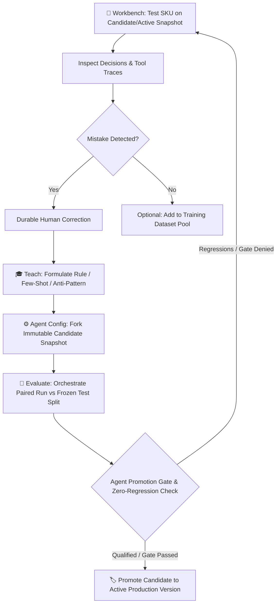
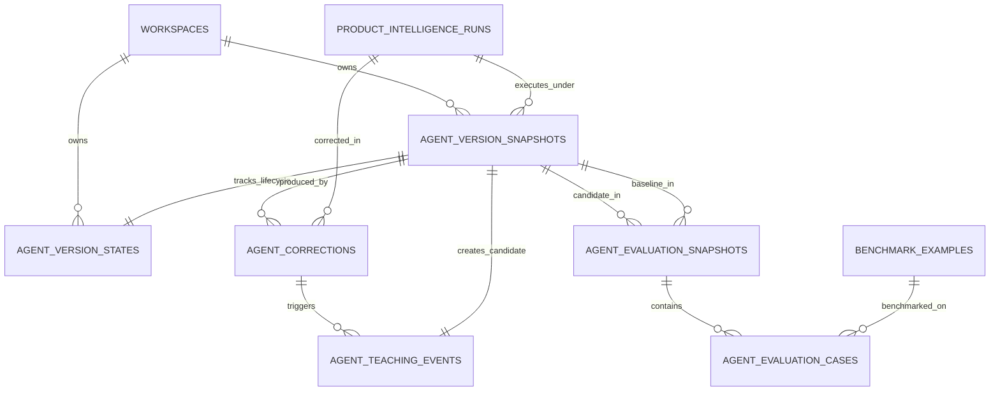

# Product Specification: Agent Lab — The Agent Training & Alignment Interface

**Status:** Approved Product Direction & Technical Specification  
**Target Surface:** `src/client/components/agent-lab/` + `src/product-intelligence/`  
**Supercedes:** Issue #24 ("Runs | Policies | Metrics" review console framing)  
**Author:** Pair Programming Agent & Human Operator  

---

## 1. Executive Summary & Architectural Pillars

### 1.1 The Core Operating Loop
Agent Lab is a **Human-in-the-Loop Agent Training, Alignment, and Curriculum Management Studio** for the Baystate CMS Product Intelligence worker.

The foundational workflow is:
$$\textbf{Workbench} \longrightarrow \textbf{Correct} \longrightarrow \textbf{Teach} \longrightarrow \textbf{Evaluate} \longrightarrow \textbf{Promote}$$



### 1.2 Architectural Invariants & Non-Negotiables

1. **Safety & Policy Invariants are Non-Trainable:**
   - Safety constraints (tool allowlists, network boundaries, SSRF prevention, data-sharing policies, execution deadlines, token budgets, taxonomy ID grounding, image rights validation, terminal structured submission schemas) are **enforced deterministically in CMS code and the immutable `PolicyGateway` (`configId`)**.
   - Trainable Agent Versions configure **behavioral guidance** (domain instructions, search strategies, packaging OCR interpretation, fact extraction heuristics, and few-shot examples). They do *not* mutate security or runtime constraints.
2. **Workspace Scope & At-Most-One Active Version Constraint:**
   - All snapshots, lifecycle states, corrections, teaching events, evaluation runs, and evaluation case records carry an explicit `workspace_id NOT NULL` foreign key.
   - A unique partial index enforces **at most one active version per workspace** (`WHERE lifecycle_status = 'active'`), while startup seeding and atomic promotion transactions ensure an active version is maintained.
3. **Truly Immutable Content Snapshots + Separate Lifecycle State:**
   - `agent_version_snapshots` is permanently immutable. It holds only content fields and a deterministic SHA-256 `content_hash`.
   - Mutable lifecycle state lives in `agent_version_states` (`draft` $\to$ `evaluating` $\to$ `qualified` $\to$ `active` $\to$ `retired`).
4. **Immutable Run-Time Import Authorization:**
   - Every run permanently records its execution authorization at launch time: `agent_version_snapshot_id`, `version_role_at_execution` (`active | candidate | historical`), and `import_eligible_at_execution` (1 only if active at launch).
   - An experimental candidate run *never* becomes import-eligible in the future, even if its snapshot is subsequently promoted to active.
5. **Strict Separation of Concerns & Contamination-Safe Dataset Splits:**
   - **`agent_corrections`**: Durable record of human-asserted ground truth for an exact run.
   - **`agent_teaching_events`**: Links a correction to a new candidate snapshot.
   - **`train` Pool**: Open for operator exploration, prompt tuning, and few-shot mining. Full gold label inspection allowed.
   - **`validation` Split**: Inspectable for debugging; any case used to teach is flagged as contaminated in database state and excluded from clean validation scoring.
   - **`promotion_test` Split**: Hidden gold labels (enforced at API/repository layer); automated evaluation; provides diagnostic summaries without leaking gold answers prior to promotion. Teaching on this split is strictly rejected.
   - **`holdout` Split**: Completely protected; API/repository layer surfaces aggregate counts and metrics only, never raw labels. Teaching on this split is strictly rejected.
6. **Per-Case Durable Evaluation Persistence & Completeness Invariant:**
   - Evaluations persist both an aggregate header (`agent_evaluation_snapshots`) and granular paired experiment rows (`agent_evaluation_cases`).
   - **Completeness Invariant:** An evaluation with any missing, failed, cancelled, or unpaired cases cannot qualify a version, even if metrics from completed cases happen to pass.
7. **Dedicated Agent Promotion Gate Authority:**
   - Promotion requires passing `evaluateAgentPromotionGate()`, which reuses the existing measured-metric rollout thresholds (`reviewed_import`) combined with a zero-tolerance regression check (0 wrong-product, wrong-variant, or image-rights regressions).
8. **100% Byte-for-Byte Baseline Equivalence:**
   - Version `v1` is an empty customizable layer (`instructions: []`, `few_shot_examples: []`) atop `compiler_v1`.
   - Automated tests assert `compiled.fullText === existing.text` and `compiled.promptHash === existing.promptHash`.

---

## 2. Top-Level Surfaces & UX Topology

The primary navigation of Agent Lab (`?view=agentlab`) provides:

```
[ 🧪 Agent Lab ]  Active: v12 (Production) • Candidate: v13-rev2 (Evaluating) • [ Promotion Gate: PASS ]
Tabs: [ 🔬 Workbench ] [ 📚 Curriculum & Datasets ] [ 🧪 Evaluate ] [ ⚙️ Agent Config ] [ 🏷️ Versions ] | [ 📋 Runs ]
```

---

### Pillar 1: 🔬 The Workbench (Interactive Task & Correction Canvas)

**Purpose:** Test an agent snapshot on a real product task, inspect execution traces and evidence side-by-side, and record durable human corrections.

#### Capabilities:
1. **Version Selector:** Run against `Active (Production)`, `Candidate (Draft/Evaluating)`, or any historical snapshot.
2. **Product Task Input:** Load from catalog SKU, onboarding spreadsheet row, dataset train case, or enter raw GTIN/Register Name/Hints.
3. **Side-by-Side Canvas:**
   - **Left Panel (Execution Trace):** Real-time/completed tool calls, retrieved web pages, extracted facts, packaging OCR output, image rights status.
   - **Center Panel (Agent Output):** Exact identity resolution, normalized title, extracted attributes, suggested Category Pages, commerce image selections, and abstention reasons.
   - **Right Panel (Correction Canvas):** Direct field-level overrides. The operator can correct brand identity, title, facts, category page assignments, or image selections.
4. **Execution Authority Badging:** Candidate runs are permanently badged `🧪 Candidate Run (Import Ineligible)`.
5. **Action Bar:**
   - `⚡ Run Task`
   - `✏️ Record Correction`
   - `🎓 Teach from Correction` (Opens Teach Modal)
   - `📥 Import to Onboarding` (Enabled *only* for runs where `import_eligible_at_execution === 1`)

---

### Pillar 2: 🎓 Teach (The Durable Feedback Loop)

**Purpose:** Convert a human correction into an explicit, auditable learning event that forks a new candidate snapshot.

#### Teaching Workflow:
1. Operator inspects a run mistake and submits a correction (`agent_corrections` row created).
2. Operator clicks **"Teach from Correction"**:
   - **Context Captured:** Input snapshot, agent error, human corrected output, failure mode classification.
   - **Operator Rationale:** Structured "Why" explanation (e.g. *"When the register price strongly conflicts with a candidate multipack quantity, treat it as a conflict signal and require exact GTIN/variant evidence before accepting the multipack"*).
3. **Teaching Output Selection:**
   - **Add In-Context Few-Shot Example:** Formats a clean input/output example into the candidate's example bank.
   - **Add / Refine Guideline Rule:** Creates a domain behavioral rule in the specified category (`identity`, `extraction`, `facts`, `classification`, `sources`, `abstention`).
   - **Add Negative Anti-Pattern:** Forbids deceptive sources or erroneous extrapolation.
   - **Add to Train Dataset:** Stores as a training case with difficulty tags (`wrong_size_retailer`, `multi_variant`, etc.).
4. **Outcome:** Generates a new **Candidate Snapshot** (e.g. `v13-rev3`), linking the originating correction and teaching event in its provenance log.

---

### Pillar 3: 📚 Curriculum & Datasets (Dataset Management & Contamination Safety)

**Purpose:** Manage golden truth cases, benchmark suites, and difficulty curricula across strictly isolated splits.

#### Split Topology & Permissions (Enforced at API & DB Layer):
- **🟢 Train Pool:** Visible to operators for teaching and few-shot mining. Full gold label inspection allowed.
- **🟡 Dev / Validation Split:** Inspectable for debugging. If a case is taught on, it is automatically marked as *contaminated* in database state and excluded from clean validation scoring.
- **🔵 Promotion Test Split:** Hidden gold labels. Evaluated automatically; failure diagnostics are presented without revealing complete gold answers before promotion. Teaching actions attempting to consume promotion test cases are rejected.
- **🔴 Holdout Split:** Protected holdout suite; surfaces aggregate metrics and case counts only, never raw labels. Teaching actions attempting to consume holdout cases are rejected.

#### Features:
1. **Difficulty Tagging:** Filter by `upc_normalization`, `shopify_variant`, `woocommerce_variant`, `wrong_size_retailer`, `packaging_redesign`, `discontinued`, `ambiguous_brand`, `distributor_conflict`, `image_rights_uncertainty`, `abstention_correct`.
2. **Contamination Tracker:** Displays which benchmark cases have been used in few-shot banks or rule motivations.

---

### Pillar 4: 🧪 Evaluate (Paired Candidate Orchestration & Case Matrix)

**Purpose:** Orchestrate paired evaluation runs of Candidate vs Active versions over frozen test datasets and compute differential regression matrices.

#### Evaluation Orchestration (`POST /api/product-intelligence/versions/:id/evaluate`):
1. **Dataset Freeze & Selection:** Locks the target dataset snapshot (default: `promotion_test` split of `pi-golden-v1`).
2. **Shadow Execution:**
   - Spawns shadow runs for the Candidate Snapshot across all benchmark cases $\to$ captures exact `candidate_run_id` per case.
   - Spawns (or pairs with existing verified) baseline shadow runs for the Active Snapshot $\to$ captures exact `baseline_run_id` per case.
3. **Paired Scoring & Case Persistence:**
   - Scores each case against gold labels via `comparePredictionToGold()`.
   - Inserts `agent_evaluation_cases` rows (`fixed`, `regressed`, `unchanged`, `critical_regression`).
4. **Aggregate Evaluation Snapshot & Completeness Check:**
   - Aggregates rates into `agent_evaluation_snapshots`.
   - Checks that 100% of cases are completed and paired (any pending/failed/cancelled case voids qualification).
   - Evaluates `evaluateAgentPromotionGate({ candidateReport, baselineReport, currentRolloutConfig, regressions, complete })`.
5. **Interactive Debugging:** Clicking any regression case opens the case directly in the **Workbench** with the candidate version pre-loaded.

---

### Pillar 5: ⚙️ Agent Config (Behavioral Guidance Studio)

**Purpose:** Inspect and tune behavioral instructions and the active few-shot bank for candidate drafts.

#### Components:
1. **Persona & Domain Rules:** Categorized behavioral guidelines (Brand Identity, Fact Prioritization, Source Preferences, Packaging OCR, Abstention Criteria).
2. **Few-Shot Example Bank:**
   - Active examples included in prompt compilation.
   - **Configurable Token Budget Gauge:** Shows real-time token count vs configured limit (e.g. 3,500 / 6,000 tokens for the selected model/compiler).
   - Toggles to activate/deactivate specific examples.
3. **Referenced Policy Snapshot:** Read-only display of the backing security/runtime policy (`configId`, model route, allowed tools, network policy, budgets). Changing runtime policies routes through the Policy Authority.

---

### Pillar 6: 🏷️ Versions & Promotion (Lineage & Safe Rollout)

**Purpose:** Manage the complete version history, inspect diffs, verify evaluation scorecards, and promote qualified candidates.

#### Lineage & Provenance Chain:
Every version records:
- **Parent Version ID** & **Compiler Version** (`compiler_v1`).
- **Content Hash:** Deterministic SHA-256 over parent, compiler, instruction set, few-shot set, and policy config ID.
- **Teaching Audit:** Motivating corrections and operator rationale.
- **Evaluation Stamp:** Linked `agent_evaluation_snapshots`, per-case differential, and Promotion Gate verdict.

#### Promotion Action:
- The **"Promote Candidate to Active"** button is enabled **only when** the candidate's latest evaluation snapshot passes `evaluateAgentPromotionGate()` with 100% paired case completion and zero critical regressions.
- Promotion atomically updates `agent_version_states`: sets candidate `lifecycle_status = 'active'`, marks prior active version as `retired`, and updates production execution routing.

---

### Pillar 7: 📋 Runs (The Raw Telemetry & Experiment Archive)

**Purpose:** Comprehensive log of all runs (Workbench tests, evaluation worker executions, and production onboarding research).

- Preserves all PI-1 through PI-10 features: `AgentRunTimeline`, `EvidenceInspector`, `ImageEvidencePanel`, `ProductListingPreview`, and `ConflictReviewPanel`.
- Filter by: `Version`, `Execution Role` (`active`, `candidate`, `historical`), `Import Eligible` (yes/no), `Status`.

---

## 3. Data Model & Lineage Architecture



### 3.1 SQLite Tables (Migration `v30`)

#### `agent_version_snapshots` (Truly Immutable Content)
- `id` (TEXT PRIMARY KEY)
- `workspace_id` (TEXT NOT NULL REFERENCES `workspaces(id)`)
- `version_number` (INTEGER NOT NULL)
- `revision_number` (INTEGER NOT NULL)
- `parent_version_id` (TEXT NULL REFERENCES `agent_version_snapshots(id)`)
- `compiler_version` (TEXT NOT NULL)
- `instructions_json` (TEXT NOT NULL)
- `few_shot_examples_json` (TEXT NOT NULL)
- `few_shot_token_budget` (INTEGER NOT NULL DEFAULT 4000)
- `policy_config_id` (TEXT NOT NULL)
- `content_hash` (TEXT NOT NULL UNIQUE)
- `created_by` (TEXT NOT NULL)
- `created_at` (TEXT NOT NULL)
- `change_summary` (TEXT NOT NULL DEFAULT '')

#### `agent_version_states` (Mutable Workspace Lifecycle State)
- `version_id` (TEXT PRIMARY KEY REFERENCES `agent_version_snapshots(id)`)
- `workspace_id` (TEXT NOT NULL REFERENCES `workspaces(id)`)
- `lifecycle_status` (TEXT NOT NULL CHECK(lifecycle_status IN ('draft', 'evaluating', 'qualified', 'active', 'retired')))
- `active_evaluation_id` (TEXT NULL REFERENCES `agent_evaluation_snapshots(id)`)
- `activated_at` (TEXT NULL)
- `retired_at` (TEXT NULL)
- `updated_at` (TEXT NOT NULL)

*(Unique partial index: `CREATE UNIQUE INDEX idx_agent_version_active_per_workspace ON agent_version_states(workspace_id) WHERE lifecycle_status = 'active'`)*

#### `agent_corrections` (Durable Ground Truth)
- `id` (TEXT PRIMARY KEY)
- `workspace_id` (TEXT NOT NULL REFERENCES `workspaces(id)`)
- `run_id` (TEXT NOT NULL REFERENCES `product_intelligence_runs(id)`)
- `version_id` (TEXT NOT NULL REFERENCES `agent_version_snapshots(id)`)
- `original_result_hash` (TEXT NOT NULL)
- `corrected_fields_json` (TEXT NOT NULL)
- `failure_mode` (TEXT NOT NULL)
- `notes` (TEXT NOT NULL DEFAULT '')
- `created_by` (TEXT NOT NULL)
- `created_at` (TEXT NOT NULL)

#### `agent_teaching_events` (Learning Provenance)
- `id` (TEXT PRIMARY KEY)
- `workspace_id` (TEXT NOT NULL REFERENCES `workspaces(id)`)
- `correction_id` (TEXT NOT NULL REFERENCES `agent_corrections(id)`)
- `resulting_version_id` (TEXT NOT NULL REFERENCES `agent_version_snapshots(id)`)
- `actions_json` (TEXT NOT NULL)
- `rationale` (TEXT NOT NULL)
- `created_by` (TEXT NOT NULL)
- `created_at` (TEXT NOT NULL)

#### `agent_evaluation_snapshots` (Aggregate Evaluation Header)
- `id` (TEXT PRIMARY KEY)
- `workspace_id` (TEXT NOT NULL REFERENCES `workspaces(id)`)
- `candidate_version_id` (TEXT NOT NULL REFERENCES `agent_version_snapshots(id)`)
- `baseline_version_id` (TEXT NOT NULL REFERENCES `agent_version_snapshots(id)`)
- `dataset_id` (TEXT NOT NULL REFERENCES `benchmark_datasets(id)`)
- `dataset_hash` (TEXT NOT NULL)
- `split_group` (TEXT NOT NULL)
- `scorecard_json` (TEXT NOT NULL)
- `promotion_gate_verdict_json` (TEXT NOT NULL)
- `status` (TEXT NOT NULL CHECK(status IN ('running', 'passed', 'failed', 'cancelled')))
- `created_at` (TEXT NOT NULL)
- `completed_at` (TEXT NULL)

#### `agent_evaluation_cases` (Durable Paired Experiment Rows)
- `id` (TEXT PRIMARY KEY)
- `evaluation_id` (TEXT NOT NULL REFERENCES `agent_evaluation_snapshots(id)`)
- `workspace_id` (TEXT NOT NULL REFERENCES `workspaces(id)`)
- `benchmark_example_id` (TEXT NOT NULL REFERENCES `benchmark_examples(id)`)
- `product_sku` (TEXT NOT NULL)
- `candidate_run_id` (TEXT NOT NULL REFERENCES `product_intelligence_runs(id)`)
- `baseline_run_id` (TEXT NOT NULL REFERENCES `product_intelligence_runs(id)`)
- `candidate_outcome` (TEXT NOT NULL)
- `baseline_outcome` (TEXT NOT NULL)
- `comparison_json` (TEXT NOT NULL)
- `delta_class` (TEXT NOT NULL CHECK(delta_class IN ('fixed', 'regressed', 'unchanged')))
- `critical_regression` (INTEGER NOT NULL DEFAULT 0)
- `status` (TEXT NOT NULL CHECK(status IN ('pending', 'completed', 'failed')))
- `created_at` (TEXT NOT NULL)

#### Execution Authorization Columns on `product_intelligence_runs`
- `agent_version_snapshot_id` (TEXT NULL REFERENCES `agent_version_snapshots(id)`)
- `agent_version_content_hash` (TEXT NULL)
- `version_role_at_execution` (TEXT NOT NULL DEFAULT 'active')
- `import_eligible_at_execution` (INTEGER NOT NULL DEFAULT 1)

#### Benchmark Dataset Migration (`benchmark_examples`)
- `split_group` check constraint expanded to `('train', 'validation', 'promotion_test', 'holdout')`.
- `is_contaminated` (INTEGER NOT NULL DEFAULT 0)
- `contamination_version_id` (TEXT NULL REFERENCES `agent_version_snapshots(id)`)

---

## 4. Prompt Compilation Architecture

Deterministic prompt compiler (`compiler_v1`):

```typescript
export interface CompiledAgentPrompt {
  fullText: string;
  promptHash: string;
  includedExamples: AgentFewShotExample[];
  tokenEstimate: number;
}

export function compileAgentPrompt(
  version: AgentVersionSnapshot,
  input: ProductResearchInput,
  context: ProductResearchContext
): CompiledAgentPrompt {
  // 1. Safety & Execution Scaffold (untrusted JSON input, deadlines, terminal tools)
  // 2. Behavioral Domain Instructions (grouped by category from version.instructions_json)
  // 3. Deterministically Budgeted Few-Shot Examples (fitting within version.few_shot_token_budget)
  // 4. Workflow Guidelines & Response Contract
}
```

### Baseline Equivalence Invariant:
```typescript
const compiled = compileAgentPrompt(v1Baseline, input, context);
const existing = buildResearchPrompt(input, context);

expect(compiled.fullText).toBe(existing.text);
expect(compiled.promptHash).toBe(existing.promptHash);
```

---

## 5. End-to-End Operator Walkthrough

```
1. Operator opens Workbench -> Selects SKU "076280014028" (Register: "BLUE BUFF CAN DOG 12.5OZ").
2. Runs task on Candidate v13 -> Agent proposes 12-pack case from Chewy for $39.99.
3. Operator records Correction -> Sets Title to single can, Pack Count = 1, Price = $3.49.
4. Operator clicks "Teach from Correction":
   - Adds Rule: "When the register price strongly conflicts with a candidate multipack quantity, treat it as a conflict signal and require exact GTIN/variant evidence before accepting the multipack."
   - Adds Few-Shot Example.
5. System creates Candidate Snapshot v13-rev3 with status = 'draft'.
6. Operator navigates to Evaluate -> Triggers Evaluation on "pi-golden-v1" (promotion_test split).
7. Evaluation Orchestrator runs candidate v13-rev3 and baseline v12 shadow runs, writing agent_evaluation_cases rows.
8. Evaluation Matrix displays:
   - 48 Unchanged (Pass)
   - 2 Fixed (🟢 Blue Buffalo + Wellness Can)
   - 0 Regressions (🔴)
   - 100% cases completed and paired.
   - Promotion Gate: PASS.
9. Operator navigates to Versions -> Views Diff & Scorecard -> Clicks "Promote v13-rev3 to Active".
10. v13 is now Active in Production.
```
